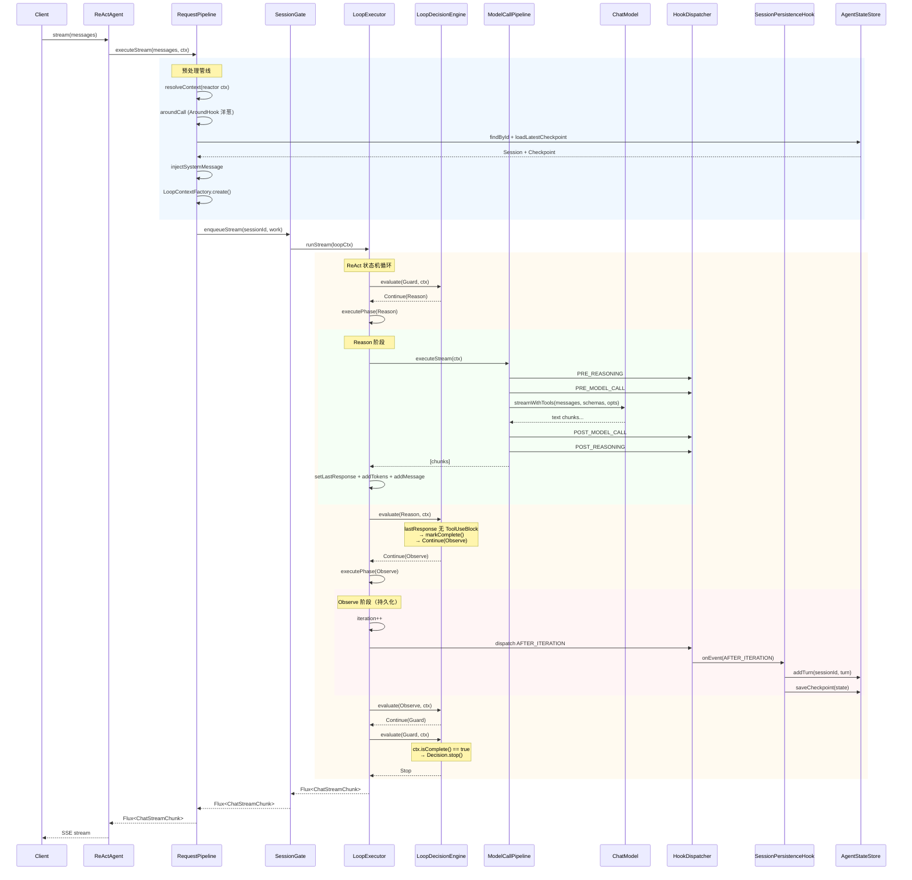
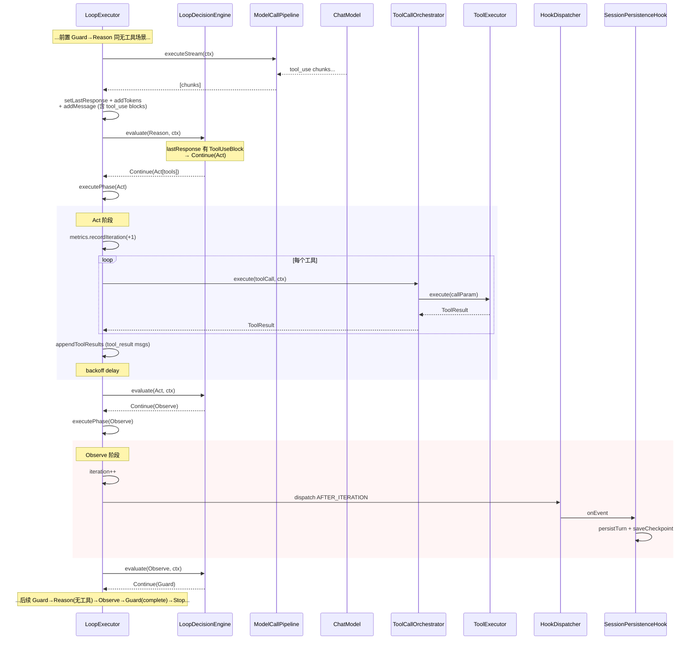
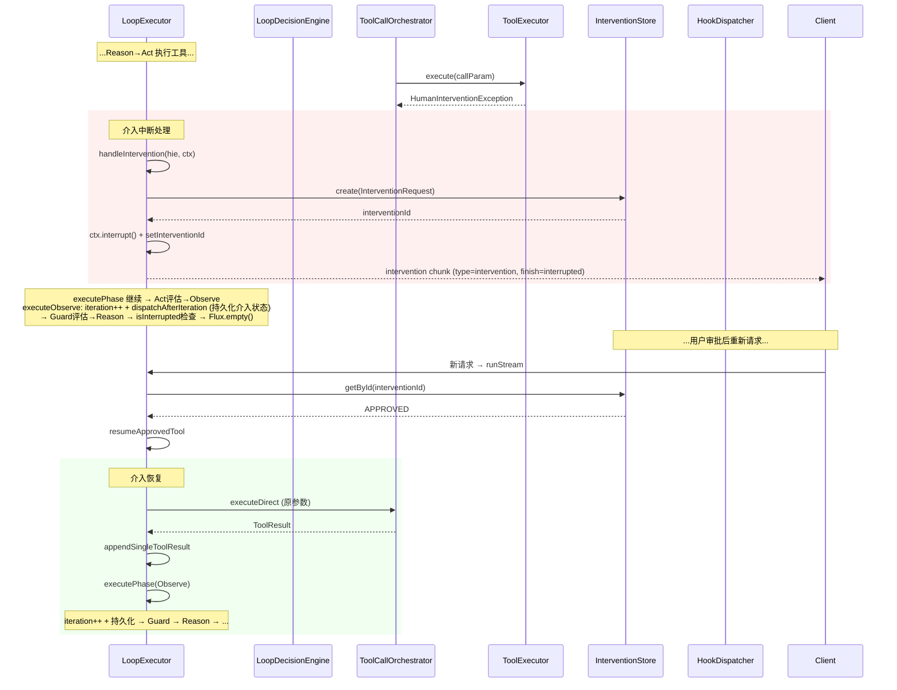
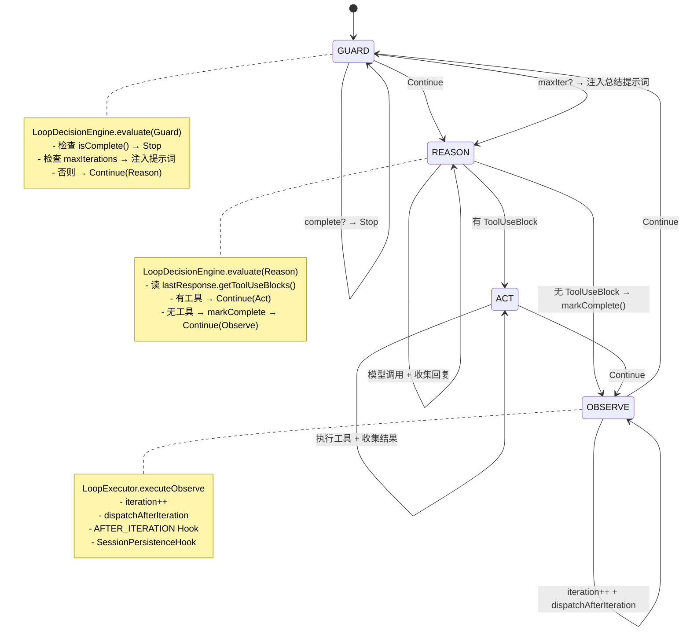

# ReAct Agent 请求生命周期时序图

## 无工具调用（单轮对话）

## 有工具调用

## 介入中断与恢复

## 四阶段状态机总览

## 组件职责一览

| 组件 | 职责 | 依赖 |
|------|------|------|
| **ReActAgent** | 薄门面，组装各子系统 | RequestPipeline |
| **RequestPipeline** | 预处理：解析上下文、加载会话、注入系统消息、AroundHook | LoopExecutor, AgentStateStore, SessionGate |
| **SessionGate** | 会话级 FIFO 串行化 | — |
| **LoopExecutor** | ReAct 循环执行器，executePhase 路由中枢 | LoopDecisionEngine, ModelCallPipeline, ToolCallOrchestrator |
| **LoopDecisionEngine** | 纯同步状态机，4 阶段评估，唯一路由裁判 | — |
| **ModelCallPipeline** | 模型调用 + PRE/POST Hook 管线 | ChatModel, HookDispatcher |
| **ToolCallOrchestrator** | 工具执行编排 + 介入审批 | ToolExecutor, HookDispatcher |
| **HookDispatcher** | Hook 事件分发 | HookChain |
| **SessionPersistenceHook** | AFTER_ITERATION 监听，持久化 turn + checkpoint | AgentStateStore |
